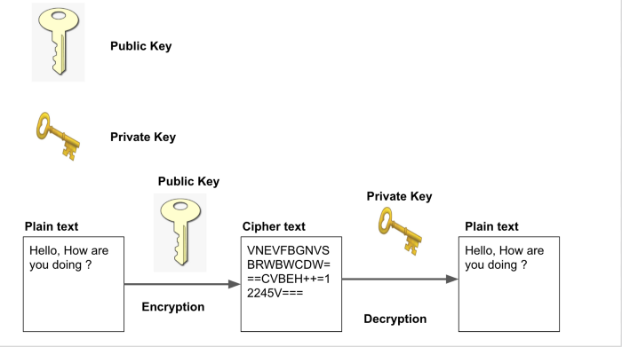
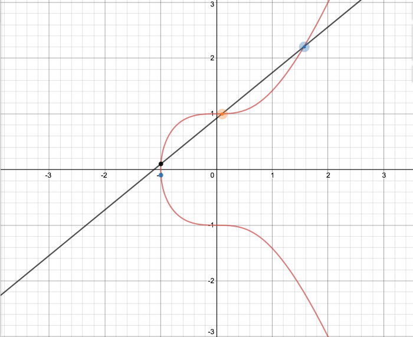
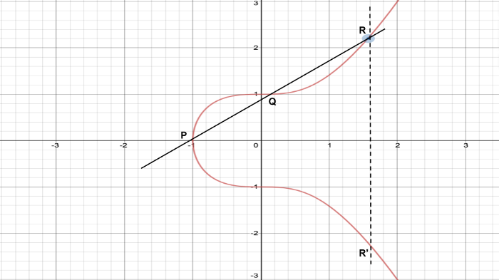
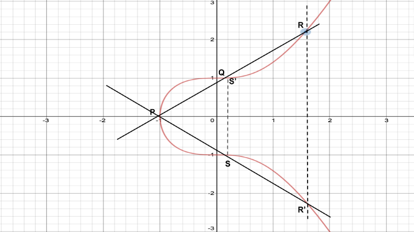
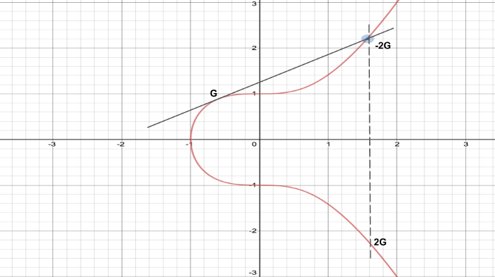

# Criptografia de Curvas Elípticas - Teoria

## 1. Public /Asymmetric Key Cryptography

&emsp;Instead of a single key for encryption, Public Key Cryptography uses a pair of keys i.e Public Key and Private Key. These two keys are mathematically linked. Private key acts like a password and only the user store it. Public key acts as your address & everyone in the world knows about it. Anyone in the world can send you a message by encrypting with your public key. The encrypted message can be only decrypted by your private key.

 

## 2. Elliptic Curve Cryptography

&emsp;Elliptic Curve forms the foundation of Elliptic Curve Cryptography. It’s a mathematical curve given by the formula 

y² = x³ + a*x² + b

where ‘a’ and ‘b’ are constants. Following is the diagram for the curve y² = x³ + 1.

 

 

&emsp;You can observe two unique characteristics of the above curve:

 

- The curve is symmetric about the X-axis. Every point on the curve lying above the X-axis has a reflection below it;
- If a non-vertical line is drawn, it can intersect the curve in at most 3 points.

&emsp;Elliptic Curve defines addition operation where two points are chosen on the curve. A line is drawn between them and the intersection of this line with the curve is found. Further, the reflection of this point on X-axis becomes the result. Following is an illustration of the above operation.

 

 

&emsp;In the above diagram, two points P and Q are chosen. The line joining these two points meets the curve at point R. Reflection of point R on the X-axis is R’.

 

&emsp;The process can now be repeated with the points P and R’. As illustrated below, the addition of these two points will result in S’ on the curve above the X-axis.

 

 
 

#### &emsp; 2.1 Trapdoor function

&emsp;Trapdoor function forms the cornerstone of Public Key Cryptography. In simple words, it’s a function that is easy to compute in one direction but computationally difficult in the opposite direction.

&emsp;As a simple example is you need to find two prime numbers whose product is 39203. You will begin with the number 2, 3, 5, 7, etc until you find a prime number that divides 39203. But, if given that one of the numbers is 197, you can find the other by entering 39203 / 197 = 199.

&emsp;This function in the above example can be made difficult by increasing the number of digits. Given two prime numbers, you can easily multiply and find the result. Yet, given a result, it becomes difficult (depending on the digits) to find two prime numbers such that their product equals the result.

 

> 
 &emsp;The same concept is extended to an Elliptic Curve. We choose a point on the curve and multiply with itself ’n’ times. We can easily find the location of destination point given the starting point and ’n’. If you are only given the destination point & starting point, it becomes difficult to find the value of ’n’.

 

#### &emsp; 2.2 Generation of Public & Private Keys in ECC

&emsp;A pre-determined point is selected on the curve. This point is known as the Generation point (G). The private key is randomly generated and corresponds to the number ’n’. The generator point (G) must be multiplied with itself ’n’ times to find point K, which is the public key.

 

 

&emsp;Adding a point G with itself is equivalent to drawing a tangent touching the curve at point G. This tangent intersects the curve at the point -2G. Reflection of the point -2G on X-axis is 2G. Adding 2G with itself results in 4G and so on and so forth, we can compute 8G, 16G, 32G, etc.

 

&emsp;National Institue of Standards and Technology (NIST) has defined standards for elliptic curve with a set of constants. Bitcoin uses the secp256k1 which is y² = x³ + 7.

 

&emsp;

 

## 3. References

[1] https://medium.com/dev-genius/introduction-to-elliptic-curve-cryptography-567e47b0e49e